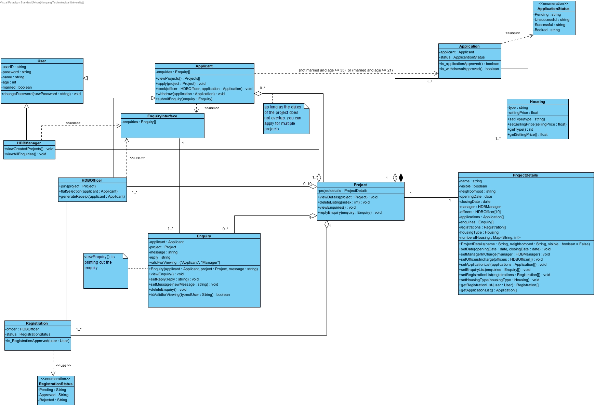

# 2002-Group-4

## Roadmap:

### Unfinished/to fix
- To implement: Specialization of User entity (Applicant, Officer, Manager) and their respective loading. Can simply leave functionality empty first.
~~- To implement: NRIC Validation upon login~~
- To discuss: Possible UserFactory. Proper boundary-entity-controller workflow.

### Upcoming
- To implement: Everything else.

## Deviations from current UML
- Divided responsibility of views and logic - overall UML remains similar, but with separation of tasks.